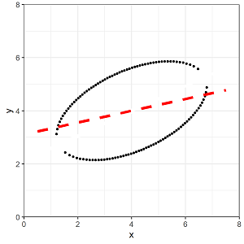

```{r setup, include=FALSE}
library(tidyverse)
library(wooldridge)
wage1 <- wooldridge::wage1
wage.lm0 <- lm(wage ~ educ - 1, data = wage1)
wage.lm1 <- lm(wage ~ educ, data = wage1)
knitr::opts_chunk$set(echo = TRUE, warning = FALSE, message = FALSE)
```

## Ocular Estimation

```{r, echo = FALSE, out.width='40%', results='markup'}
set.seed(8675309)
n <- 20
v <- list(p1 = NULL, p2 = NULL, p3 = NULL, p4 = NULL, dat = NULL,
  MSE_guess = NULL, intercept_guess = 30, slope_guess = 1.5, 
  MSE_true = NULL, intercept_true = NULL, slope_true = NULL)
## Create some x values
x <- runif(n = n, min = 5, max = 95)
# pick a random number for the intercept
beta_0 <- rnorm(n = 1, mean = 30, sd = 100)
# pick a random number for the slope
beta_1 <- rnorm(n = 1, mean = 1.5, sd = 2)
# Create some individual-level "noise"
noise <- rnorm(n = n, mean = 0, sd = 25 * abs(beta_1))
# Create the y values
y <- beta_0 + (beta_1 * x) + noise
dat <- bind_cols(x = x, y = y)
# Run a linear regression of y on x using lm()
fit <- lm(y ~ x, data = dat)
v$intercept_true <- coef(fit)[1]
v$slope_true <- coef(fit)[2]
# Plot our data and save as an object called "p"
v$p1 <- dat %>%
  ggplot(aes(x = x, y = y)) +
  geom_point(size = 4) +
  labs(x = "", y = "") +
  xlim(0, 100) +
  ylim(min(y) - sd(y), max(y) + sd(y)) +
  theme(text = element_text(size = 20)) +
  coord_cartesian(expand  = FALSE)
datx <- dat %>%
  mutate(y_hat = v$intercept_true + (v$slope_true * x), pred_error = y - y_hat)
v$MSE_true <- mean(datx$pred_error ^ 2)
dat <- dat %>%
  mutate(y_hat = v$intercept_guess + (v$slope_guess * x), pred_error = y - y_hat)
v$MSE_guess <- mean(dat$pred_error ^ 2)
v$p2 <- geom_abline(intercept = v$intercept_guess, slope = v$slope_guess,
  color = "blue", lwd = 3)
v$p3 <- geom_segment(data = dat,
    aes(x = x, xend = x, y = y, yend = y_hat),
    color = "red", lty = "dotted", lwd = 1)
v$p4 <- geom_abline(intercept = v$intercept_true, slope = v$slope_true,
    color = "darkgrey", lwd = 3)
output <- NULL
noquote(paste0("Intercept Guess: ", round(v$intercept_guess, 3)))
noquote(paste0("Slope Guess: ", round(v$slope_guess, 3)))
noquote(paste0("MSE (Guess): ", round(v$MSE_guess, 1)))
noquote(paste0("True Intercept: ", round(v$intercept_true, 3)))
noquote(paste0("True Slope: ", round(v$slope_true, 3)))
noquote(paste0("Mean squared error: ", round(v$MSE_true, 1)))
v$p1 + v$p2 + v$p3 + v$p4
```

\newpage 
## Regression Lines

### Which of the following graphs the best-fit regression linefor the following data? 
 

 




\newpage
## A Simple Regression

### Regression concepts

- Population Regression Function: $Wage = \beta_0 + \beta_1Education + u$<br>
  $\beta_0$ and $\beta_1$ represent *parameters* - the true (but unknown) values for the intercept and the slope, respectively.<br>
  $u$ is the *error* - the true, random variation of wages that education doesn't capture.<br>
  $Wage$ is the *endogenous* variable (or dependent variable/explained variable/predicted variable/response/regressand).<br>
  $Education$ is assumed to be an *exogenous* variable (or independent variable/explanatory variable/predictor/control/regressor).<br>
- Estimated Regression Line: $Wage = \hat{\beta}_0 + \hat{\beta}_1Education + \hat{u}$<br>
  $\hat{\beta}_0$ and $\hat{\beta}_1$ represent *estimators* - the derived methods for estimating the intercept and the slope (e.g. OLS estimators).<br>
  $\hat{u}$ is the *residual* - the observable deviations from the predicted wage and the actual wage for each observation.<br>
  If we focus on the predictions, $\hat{wage} = \hat{\beta}_0 + \hat{\beta}_1educ$<br>
  $\hat{wage}$ is the predicted wage

### Assumptions

1. Errors have mean equal to zero, $E(u) = 0$.
2. Errors and $X$ are independent, $E(u|X) = E(u) = 0$. 

$E(u|X) = E(u) = 0 \Rightarrow Cov(u,X) = 0 \Rightarrow E(uX) = 0$

<details style="line-height:105%"><summary>Click here to see the proof that $E(u|X) = 0 \Rightarrow E(ux) = 0$.</summary>

$$Cov(u,X) = E[(u - E(u))(X - E(X))] = =E(uX) - E(u)E(X)$$

Since $E(u) = 0$, showing $Cov(u,X) = 0$ requires showing $E(uX) = 0$.

$$E_{u,X}(uX) = E_X(E_{u|X}(uX|X))$$
by the Law of Iterated Expectations (in reverse?). 

$$E(E(uX|X)) = \int{f_X(X)\int{uXf_{u|X}(u|X)du}dx} = \int{Xf_X(X)\int{uf_{u|X}(u|X)du}dx} = E_X(XE(u|X))$$
$$E_X(XE(u|X)) = E(X)E(u) = 0$$
by the Law of Iterated Expectations (again) and since $E(u) = 0$. 

Note that even if $E(u) \ne 0$, $E(u|X) = 0 \Rightarrow Cov(u,X) = 0$ since $E(uX) = E(u)E(X)$. 

</details>

$$E(y|x) = E(\beta_0 + \beta_1x + u) = \beta_0 + \beta_1 E(x|x) + E(u|x)$$

The zero conditional mean condition guarantees that: 

$$E(y|x) = \beta_0 + \beta_1 x.$$

This also guarantees that: 

$$\Delta E(y|x) = \beta_1 \Delta x.$$

\newpage
## Wages and Education

1. Using the `wage1` data, regress wages on education (and an intercept). Name this `wage.lm1`
2. Summarize the regression object using `summary()`

```{r simpleLM-solution}
wage.lm1 <- lm(wage ~ educ, data = wage1)
summary(wage.lm1)
```

### Regression without an Intercept

Duplicate this regression *without an intercept* and name it wage.lm0

```{r nointerceptLM-solution}
wage.lm0 <- lm(wage ~ educ - 1, data = wage1)
summary(wage.lm0)
```

### Plotting the Regression Line

Plot the following with base R graphics. 

1. A scatter of the data for wage against education 
2. The linear fit for the simple regression of wages on education *with* an intercept (dashed)
3. The linear fit for the simple regression of wages on education *without* an intercept (dotted)

```{r abline-solution}
plot(wage1$educ, wage1$wage)
abline(wage.lm1)
abline(wage.lm0)
```

\newpage
## Properties of OLS

1. $\sum_{i=1}^{n}{\hat{u}_i = 0}$
2. $\sum_{i=1}^{n}{x_i\hat{u_i} = 0}$
3. The *Total* Sum of Squares, $SST = \sum_{i=1}^n{(y_i-\bar{y})^2}$
4. The *Explained* Sum of Squares, $SSE = \sum_{i=1}^n{(\hat{y}_i-\bar{y})^2}$
5. The *Residual* Sum of Squares, $SSR = \sum_{i=1}^n{(y_i-\hat{y})^2}$
6. SST = SSE + SSR (see book section 2.3 for proof)
7. Goodness of Fit, $R^2 = SSE/SST = 1 - SSR/SST$
8. For simple regression it is literally true that $R^2 = r^2$, where r is the simple correlation coefficient between x and y. 

\newpage
## OLS Estimation

How do we find the best estimate for b0 and b1?

### Method of Moments

1. $E(u) = 0 \Rightarrow E(y - \beta_0 - \beta_1x) = 0$
2. $E(u|X) = 0 \Rightarrow E[x(y - \beta_0 - \beta_1x)] = 0$

By (1), $\beta_0 = E(y) - \beta_1 E(x)$, or in terms of the sample $\hat{\beta_0} = \bar{y} - \hat{\beta_1} \bar{x}$.

By (2), $\frac{1}{n} \sum_{i=1}^n x_i(y_i - \hat{\beta_0} - \hat{\beta_1} x_i) = 0$

Substituting for $\hat{\beta_0}$, we get $\frac{1}{n} \sum_{i=1}^n x_i(y_i - (\bar{y} - \hat{\beta_1} \bar{x}) - \hat{beta_1} x_i) = 0$

Solving for $\hat{\beta_1}$, we have $\hat{\beta_1} = \frac{\sum_{i=1}^n (x_i - \bar{x})(y_i - \bar{y})}{\sum_{i=1}^n (x_i - \bar{x})^2}$, or $\frac{Cov(xy)}{Var(x)}$. 

We can further simplify the first formula for $\hat{\beta_1}$ as $\hat{\beta_1} = \frac{\sum_{i=1}^n (x_i - \bar{x})y_i}{\sum_{i=1}^n (x_i - \bar{x})^2}$

### Ordinary Least Squares:

$$\sum_{i=1}^n\hat{u}^2 = \sum_{i=1}^n(y_i – \hat{\beta}_0 – \hat{\beta}_1x_i)^2$$

The first order condition with respect to $\beta_1$ is $\sum_{i=1}^n 2(y_i – \hat{\beta}_0 – \hat{\beta}_1 x_i)x_i = 0$.

Dividing by 2 and rearranging slightly, $\sum_{i=1}^n x_i(y_i – \hat{\beta}_0 – \hat{\beta}_1 x_i) = 0$.

This is identical to the condition for the method of moments estimator above.
