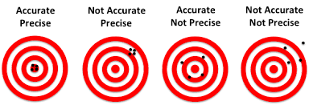
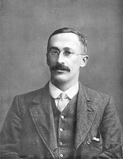

<style type="text/css">
h1{font-size: 24pt}
h2{font-size: 20pt}
h3{font-size: 18pt}
h4,h5,h6{font-size: 16pt}
body{font-size: 16pt}
</style>

<script language="JavaScript">
$(function() {
   var editor;
   $('.ace_editor').each(function( index ) {
     editor = ace.edit(this);
     editor.setFontSize("16px");
   });
})
</script>

```{r setup, include=FALSE}
library(learnr)
library(gradethis)
gradethis::gradethis_setup()
knitr::opts_chunk$set(echo = FALSE)
```

## Unbiasedness and Efficiency

Unbiasedness measures the *accuracy* of an estimator; efficiency measures the *precision* of an estimator. 

There is often a trade-off between unbiasedness and efficiency (bias versus variance). 

```{r, out.width = '600px', fig.align = 'center'}

```

### Unbiasedness

An estimator, $W$, for a parameter, $\theta$, is *unbiased* if, for a given sample size, 

$$E(W) = \theta$$

This means that the mean of the sampling distribution for the estimator is always equal to the true parameter value. If we could draw infinite samples of the same size, the average of the estimates calculated using estimator $W$ would equal $\theta$. If an estimator is truly unbiased, then this average of infinite samples equals $\theta$ *even for small samples*.  

### Example of a biased estimator 

Why do we calculate the sample variance dividing by $n-1$ instead of $n$?

$$E\bigg[\frac{1}{n}\sum_{i=1}^n (X_i-\bar{X})^2\bigg] = E\bigg[\frac{1}{n}\sum_{i=1}^n \bigg((X_i-\mu) - (\bar{X}-\mu)\bigg)^2\bigg]$$

$$= E\bigg[\frac{1}{n}\sum_{i=1}^n (X_i-\mu)^2 
- \frac{2}{n}(\bar{X}-\mu)\sum_{i=1}^n (X_i-\mu)
+ (\bar{X}-\mu)^2\bigg]$$ 

$$= V(X) - E\bigg[(\bar{X}-\mu)^2\bigg]$$

$$= V(X)\bigg(1 - \frac{1}{n}\bigg)<V(X)$$ 

Let's simulate this (biased) estimator for different sample sizes. Run the following code to see the simulation of the bias for different sample sizes. 

```{r biasSimulation, exercise = TRUE}
set.seed(8675309)
xBar <- matrix(NA, nrow = 100000, ncol = 100)
sBar <- matrix(NA, nrow = 100000, ncol = 100)
EsBar <- NULL
sTilde <- matrix(NA, nrow = 100000, ncol = 100)
EsTilde <- NULL
for(i in 1:30) {
    for(j in 1:100000) {                     # Taking 100,000 resamples!
        x <- rnorm(n = i)
        xBar[j, i] = mean(x)
        sBar[j, i] = sd(x)
        sTilde[j, i] = mean((x-xBar[j,i])^2)
    }
  EsBar[i] <- mean(sBar[,i])
  EsTilde[i] <- mean(sTilde[,i])
}
plot(EsTilde - 1, type = 'l', xlab = "Sample Size", ylab = "Bias")
lines(EsBar - 1, type = 'l')
```

Showing that dividing by $n-1$ instead of $n$ eliminates this bias involves a similar trick: 

$$E(s^2) = E[\frac{1}{n-1}\sum_{i=1}^{n}((X_i-\mu)^2-(\bar{X}-\mu)^2)]$$
$$= E[\frac{1}{n-1}\sum{i=1}^{n}(X_i-\mu)^2 - \frac{2}{n-1}(\bar{X}-\mu)\sum{i=1}^{n}(X_i-\mu) + \frac{n}{n-1}(\bar{X}-\mu)^2$$
$$= \frac{n}{n-1}V(X) - \frac{n}{n-1}E[(\bar{X}-\mu)^2] = \frac{n}{n-1}V(X) - \frac{1}{n-1}V(X) = V(X)$$

### Efficiency

Given two unbiased estimators,$\hat{\theta}$ and $\tilde{\theta}$, for a vector of parameters, $\theta$, we say that $\hat{\theta}$ is *efficient* relative to $\tilde{\theta}$ if $V(\hat{\theta}) \le V(\tilde{\theta})$ for all of the parameters in $\theta$ and $V(\hat{\theta}_k) < V(\tilde{\theta}_k)$ for at least one parameter in $\theta$. 

We don't always have two unbiased estimators - we seldom have one! In fact, we might *prefer* to have some bias! How do we compare estimators?!?!

One way to compare estimators is to measure how far away the estimator, $W$ is from the true parameter, $\theta$, *on average*. We can capture this distance using the *mean squared error* ($MSE$) of the estimator, $E[(W-\theta)^2]$. Some algebra shows that $MSE = V(W) + [Bias(W)]^2$. 

## Asymptotic Properties

As we mentioned, we might be OK with some bias if we can improve efficiency. This is especially true if (1) the biased estimator in question *converges* to the true parameter value; and (2) we have a "large" sample. 

### Consistency

Laws of large numbers help show conditions under which the sample estimates *converge* to the true population values for large sample sizes. 

An biased estimator can still be consistent. For example, $\tilde{s}^2 = \frac{1}{n}\sum_{i=1}^n(x_i-\bar{x})^2$ is a *consistent* estimator for $\sigma^2$ even though it is biased. 

### Weak Law of Large Numbers (Chebyshev) 

As long as the variance of *X* does not increase "too fast" with *n*, then the probability that the sample mean differs from the *true* mean by a measureable amount converges to zero. 

Formally, if $\lim_{n \to \infty} \frac{1}{n^2} \sum_{i=1}^n{\sigma_i^2} = 0$, then

$$ \lim_{n \to \infty} \Pr{(|\bar{x}_n-\mu|>\epsilon)} = 0$$ 

for any $\epsilon > 0$.

### Strong Law of Large Numbers (Chebyshev) 

As long as the standard error of $\bar{x}$ is always finite, then the probability that the sample mean *equals* the mean converges to one. 

Formally, if $\lim_{n \to \infty} \frac{\sigma_n}{\sqrt{n}} < \infty$, then

$$ \Pr(\lim_{n \to \infty} \bar{x}_n=\mu) = 1$$ 

for any $\epsilon > 0$.

### Simulating LLN

Let *X* be a random variable that follows a Poisson distribution with parameter $\lambda = 1$. 

1. Create a vector taking values of 1 through 1000 and name it "size"
2. Create a loop through various sample sizes, 1 through 1000 that calculates the mean of samples of sizes 1 through 1000 from a Poisson distribution and name it "xBar"
3. Plot the squared deviations of `xBar` from the true population mean against size. 

```{r LLN, exercise=TRUE, exercise.eval=TRUE}
set.seed(8675309)
# When simulating random samples, it's a good idea to set a value for the random sead. 
# This helps make your work reproducible. 
xBar <- NULL # Create an empty object to store your xBars in before you run your loop. 


```

```{r LLN-hint}
# When simulating random samples, it's a good idea to set a value for the random sead. This helps make your work reproducible. 
set.seed(8675309)
# Define a NULL object to initiate your x-bars.
xBar <- NULL 
# Start a "for loop" over all of the different sample sizes.
# Define each element in "xBar" as the mean of randomly-drawn poisson (`rpois()`) outcomes with sample size equal to the current iteration of the loop. 
```

```{r LLN-solution}
set.seed(8675309)
xBar <- NULL 
for(i in 1:1000) {
  xBar[i] = mean(rpois(n = i, lambda = 1))
}
xBar <- data.frame(n = 1:length(xBar), xBar = xBar)
ggplot(data = xBar) +
  geom_line(aes(n, (xBar-1)^2)) + 
  geom_hline(yintercept = 0, color = 'red') + 
  ylab(expression((bar(x)-\mu)^2)) + 
  xlab("Sample Size")
```

```{r LLN-check}
grade_this({if (!inherits(.result, c("gg", "ggplot"))) {
    fail("Your class of your answer should be c('gg', 'ggplot').")}
  if (length(.result) != 9) { 
    fail("Your table should have a length of 9.") }
  pass()
})
```

## Distribution of a Sample Estimator

The law of large numbers tells us the conditions under which the point estimates of an estimator becomes indistinguishable from the true population value of the parameter. 

The central limit theorem (CLT) describes the conditions under which the *distribution* of all of the possible realizations of an estimator are approximately normal. 

### Central Limit Theorem

For "sufficiently large" $n$, the distribution of the sample mean is normal with mean $\mu_x$ and standard deviation $\sigma_x/\sqrt{n}$. Formally, 

Formally, for any $\epsilon > 0$, there exists an $n_0$ such that for all $n > n_0$, 
$$|F(\frac{\bar{X}_n-\mu}{\sigma_x/\sqrt{n}}) - \Phi(\frac{\bar{X}_n-\mu}{\sigma_x/\sqrt{n}})| < \epsilon $$
for all points on $F$. 

A "sufficiently large $n$" for the sample mean is usually about 30; in more complicated regression models 30 is rarely sufficient. 

### CLT Simulation

Let *X* be a random variable that follows a Poisson distribution with parameter $\lambda = 1$. 

1. Create a matrix of distributions where each column represents 1000 simulations of the sample mean of a Poisson distribution of sizes $n = {1, 2, ..., 100}$. (The first column consists of 1000 sample means with $n = 1$; the second consists of 1000 sample means with $n = 2$, and so on...)
2. Use plot(density()) lot the smoothed estimated densities of xBar for n = 2, 10, 30, and 100, set the x-axis limits to (-1, 3).

```{r CLT, exercise=TRUE, exercise.eval=TRUE, warning=FALSE, message =FALSE}
set.seed(8675309)
xBar <- matrix(NA, nrow = 1000, ncol = 100) |> 
  as.data.frame()


```

```{r CLT-hint}
set.seed(8675309)
xBar <- matrix(NA, nrow = 1000, ncol = 100) |> 
  as.data.frame()
# Start a "for loop" over i equal to all of the different sample sizes.
# Start *another* "for loop" over j equal to the current resample of the population for the current "ith" sample size. 
# Set the "jth" row of the current "ith" column of `xBar` equal to the mean of the current iteration of the sample mean with size i. 
# Use ggplot() + geom_density(xBar[,j]) to plot the empirical density of column j.  
```

```{r CLT-solution, warning=FALSE, message =FALSE}
set.seed(8675309)
xBar <- matrix(NA, nrow = 1000, ncol = 100) |> 
  as.data.frame()
for(i in 1:100) {
  for(j in 1:1000) {
    xBar[j, i] = mean(rpois(n = i, lambda = 1))
  }
}
ggplot() + 
  geom_density(aes(xBar[,2]), ) +
  geom_density(aes(xBar[,10])) + 
  geom_density(aes(xBar[,30])) + 
  geom_density(aes(xBar[,100])) +
  xlab(expression(bar(x))) + 
  ylab("Density") +
  xlim(-1, 3)
```

```{r CLT-check}
grade_this({if (!inherits(.result, c("gg", "ggplot"))) {
    fail("Your class of your answer should be c('gg', 'ggplot').")}
  if (length(.result) != 9) { 
    fail("Your table should have a length of 9.") }
  pass()
})
```

## Using LLN and CLT

### Student's (Gosset's) t Distribution

::: {.left style="float:left;width:63%"}

If $\bar{x}$ is distributed normal, why do we test it on a t-distribution? 

- When $\sigma_x^2$ is unknown, we use the sample estimate, $\hat\sigma_x^2$, which is a random variable (just like $\bar{x}$ is).
- $\hat\sigma_x^2 \sim \chi^2(1)$, which is basically the distribution of a square of a normal random variable (variance is based on $E(X^2)$). 
- $\frac{\bar{x}}{\hat\sigma/\sqrt{n}}$, is the *ratio* of a normal random variable ($\bar{x}$) to the square root of a $\chi^2(1)$ random variable ($\sigma^2$) divided by a constant ($\sqrt{n}$).
- William Sealy Gosset (publishing under the pseudonym "Student") derived the distribution of this ratio, and calculated its probability tables for various sample sizes. 

:::

::: {.right style="float:right;width:33%"}

```{r, out.width = '300px', fig.align = 'center'}

```

:::

### Fisher and Snedecor's F Distribution

An F-test (e.g. in ANalysis Of VAriance, ANOVA) tests the ratio of the sum of two variances

1. The variance between groups, $\sum_{i=1}^Kn_i(\bar{Y}_i-\bar{Y})/(K-1)$ 
2. The variance within groups, $\sum_{i=1}^K\sum_{j=1}^{n_i}(Y_{ij}-\bar{Y}_i)/(N-K)$

Both sums of variances are distributed $\chi^2$. 

- The variances in the numerator have $k-1$ degrees of freedom for the $k$ groups. 
- The variances in the denominator have $n-k$ degrees of freedom for the remaining information from the observations in the sample. 
- The numverator loses one degree of freedom for substituting the sample mean. 
- The resulting "F" distribution for the ratio has $k-1$ *numerator* degrees of freedom and $n-k$ *denominator* degrees of freedom. 

$$F = \frac{between variance}{within variance} \sim F(k, n-k)$$
