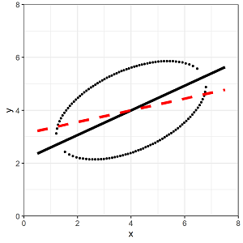

```{r setup, include=FALSE}
library(learnr)
library(gradethis)
library(wooldridge)
wage1 <- wooldridge::wage1
wage.lm0 <- lm(wage ~ educ - 1, data = wage1)
wage.lm1 <- lm(wage ~ educ, data = wage1)
gradethis::gradethis_setup()
knitr::opts_chunk$set(echo = FALSE)
```

## Regression Lines

```{r installRStudio, echo=FALSE}
question("Which of the following graphs the best-fit regression linefor the following data? ",
    answer("", message = random_encouragement()),
    answer("", correct = TRUE, message = random_praise()),
    answer("", message = random_encouragement()),
    allow_retry = TRUE
  )
```

## A Simple Regression: Wages and Education

Regression concepts

- Population Regression Function: $wage = \beta_0 + \beta_1educ + u$
  - $\beta_0$ and $\beta_1$ are *parameters* - the true (but unknown) values for the intercept and the slope. 
  - $u$ is the *error* - the true, random variation of wages that education doesn't capture. 
- Estimated Regression Line: $wage = \hat{\beta}_0 + \hat{\beta}_1educ + \hat{u}$
  - $\hat{\beta}_0$ and $\hat{\beta}_1$ are *estimators* - the derived methods for estimating the intercept and the slope (e.g. OLS estimators). 
  - $\hat{u}$ is the *residual* - the observable deviations from the predicted wage and the actual wage fore each observation. 
  - If we focus on the predictions, $\hat{wage} = \hat{\beta}_0 + \hat{\beta}_1educ$
  - $\hat{wage}$ is the predicted wage

## Example

- Using the wage1 data (pre-loaded with this tutorial), regress wages on education (and an intercept). Name this wage.lm1
- Summarize the regression object using "summary()"

```{r simpleLM, exercise = TRUE}


```

```{r simpleLM-hint}
# The "lm" function requires two main arguments: function (y ~ x1 + x2...) and data (a data frame) 
wage.lm1 <- lm(..., ...)
summary(...)
```

```{r simpleLM-solution}
wage.lm1 <- lm(wage ~ educ, data = wage1)
summary(wage.lm1)
```

```{r simpleLM-check}
grade_code()
```

- Duplicate this regression *without an intercept* and name it wage.lm0

```{r abline, exercise = TRUE}


```

```{r abline-hint}
# By default lm() includes an intercept, which is essentially a variable defined as a column of ones.
# To exclude the constant, subtract this column of ones from your formula. 
wage.lm1 <- lm(..., ...)
summary(...)
```

```{r abline-solution}
wage.lm0 <- lm(wage ~ educ - 1, data = wage1)
summary(wage.lm0)
```

```{r abline-check}
grade_code()
```

## Properties of OLS

- $\sum_{i=1}^{n}{\hat{u}_i = 0}$
- $\sum_{i=1}^{n}{x_i\hat{u_i} = 0}$
- The *Total* Sum of Squares, $SST = \sum_{i=1}^n{(y_i-\bar{y})^2}$
- The *Explained* Sum of Squares, $SSE = \sum_{i=1}^n{(\hat{y}_i-\bar{y})^2}$
- The *Residual* Sum of Squares, $SSR = \sum_{i=1}^n{(y_i-\hat{y})^2}$
- SST = SSE + SSR (see section 2.3 for proof)
- Goodness of Fit, $R^2 = SSE/SST = 1 - SSR/SST$
- For simple regression it is literally true that $R^2 = r^2$, where r is the simple correlation coefficient between x and y. 

<html>
<blockquote class="twitter-tweet"><p lang="en" dir="ltr">Analogy I use in my prog eval class:<br>Regress pain on being kicked in the face. You will find a very significant p-value, and a tiny R^2. This is because being kicked in the face really hurts, but few people are kicked in the face, and lots of other things can cause pain.</p>&mdash; Brian Kisida (@BrianKisida) <a href="https://twitter.com/BrianKisida/status/1366863555665006593?ref_src=twsrc%5Etfw">March 2, 2021</a></blockquote> <script async src="https://platform.twitter.com/widgets.js" charset="utf-8"></script>
</html>

## Plotting the Regression Line

Plot the following with base R graphics. 

- A scatter of the data for wage against education (solid) 
- The linear fit for the simple regression of wages on education *with* an intercept (dashed)
- The linear fit for the simple regression of wages on education *without* an intercept (dotted)

```{r nointerceptLM, exercise = TRUE}


```

```{r nointerceptLM-hint}
plot(..., ...)
# The abline() function lets you add a line with a given slope and intercept, or corresponding to a given regression result, or horizontal/vertical bars. 
abline(wage.lm1)
abline(wage.lm0)
```

```{r nointerceptLM-solution}
plot(wage1$educ, wage1$wage)
abline(wage.lm1)
abline(wage.lm0)
```

```{r nointerceptLM-check}
grade_code()
```

## OLS Estimation

How do we find the best estimate for b0 and b1?

- Minimize the sum of the squared errors of the fitted regression:
	$$\min_\hat{\beta}{\sum_{i=1}^n(wage_i – \hat{\beta}_0 – \hat{\beta}_1educ_i)^2} $$

